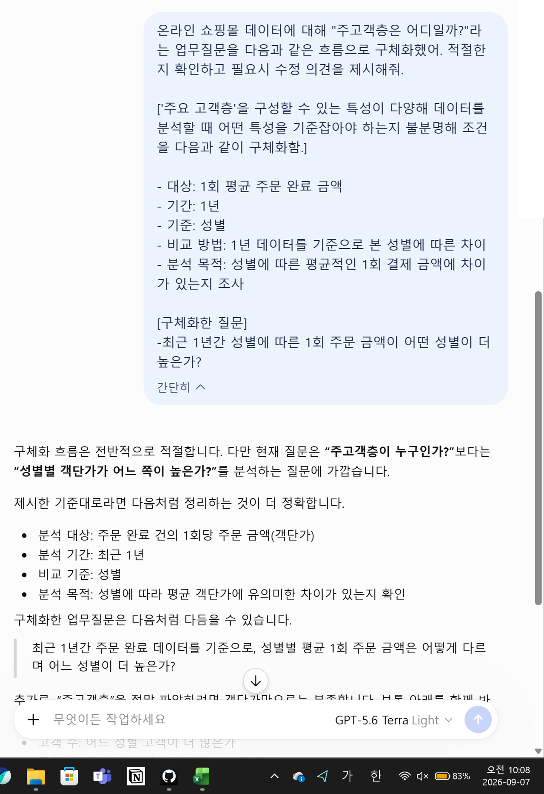
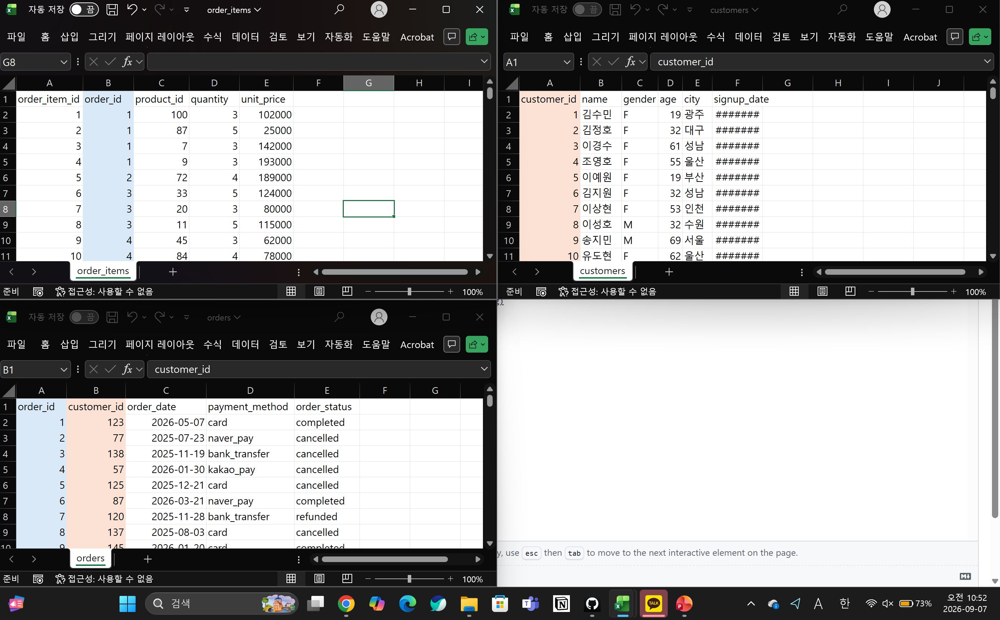
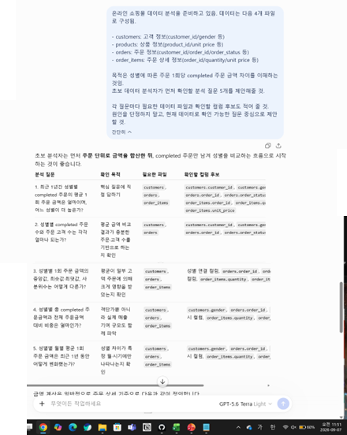
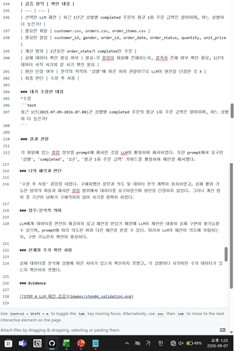
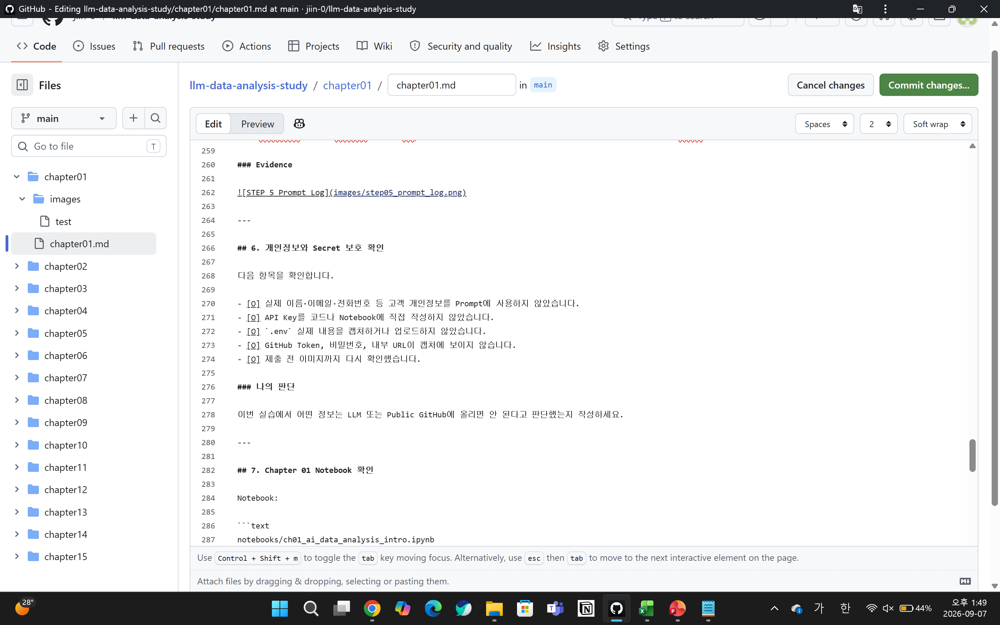
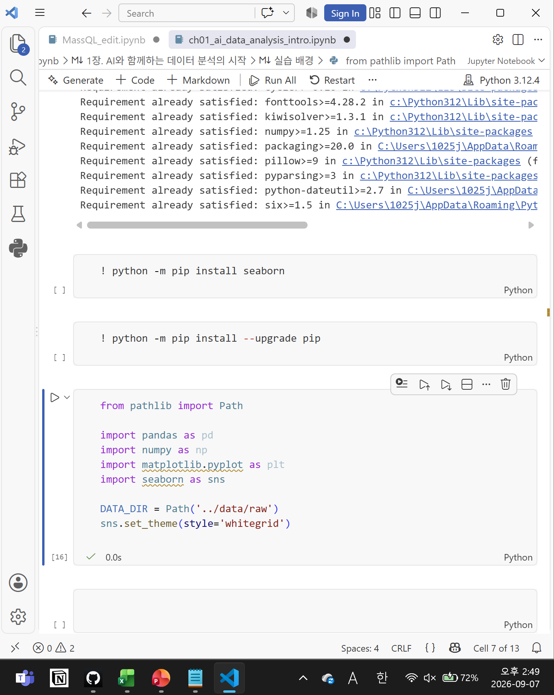

# Chapter 01 제출 답안. AI와 함께하는 데이터 분석의 시작

> 이 파일은 Chapter 01 실습 결과를 정리하여 제출하기 위한 학생용 템플릿입니다.  
> 강사 저장소의 원본 템플릿을 직접 수정하지 말고, 자신의 PC에 복사한 뒤 작성합니다.

---

## 0. 제출 정보

- 이름: 김지인
- GitHub ID: jiin-0
- 개인 저장소명: `llm-data-analysis-study`
- 작성일: 2026.09.07
- 사용한 LLM: chatGPT

### 최종 제출 URL

```text
https://github.com/jiin-0/llm-data-analysis-study/edit/main/chapter01/chapter01.md
```

---

## 1. 원래 업무 질문

### 내가 선택한 막연한 질문

```text
주고객층은 어디일까?
```

### 왜 이 질문이 모호하다고 생각했는가?

'주요 고객층'을 구성할 수 있는 특성이 다양해 데이터를 분석할 때 어떤 특성을 기준잡아야 하는지 불분명하다.

- 대상: 1회 평균 주문 완료 금액
- 기간: 1년
- 기준: 성별
- 비교 방법: 1년 데이터를 기준으로 본 성별에 따른 차이
- 분석 목적: 성별에 따른 평균적인 1회 결제 금액에 차이가 있는지 조사

### 분석 가능한 질문으로 다시 작성

```text
최근 1년간 주문 완료 데이터를 기준으로, 성별별 평균 1회 주문 금액은 어떻게 다르며 어느 성별이 더 높은가?
```

### 결과 관찰

고객 범주의 특성 중 '성별'을 기준을 잡았고, 조사 시기가 1년으로 제한되었고, '1회 평균 주문 금액'으로 비교 대상이 구체화 되었다.

### 나의 해석과 판단

기준조차 모호했던 질문에 기준, 비교 대상, 시기가 명확해지면서 분석 목적이 구체적으로 변화하였고, 이에 따라 분석에 대한 방향성이 뚜렷해졌다.

### 업무·분석적 의미

성별을 기준으로 다른 대상을 추가적으로 비교하여 성별에 따른 구매차이가 있는지 통합하여 볼 수 있고, 이에 따라 어떤 성별을 주요 고객으로 봐야하는지에 판단할 수 있을 것이다. 이를 활용하여 어떤 성별을 대상으로 마케팅하는 것이 필요할 지 판단하는데 활용할 수 있을것이다.

### 한계와 추가 확인 사항

성별에 따른 구매 빈도, 주기를 분석하지 않아 '주요 고객층'을 잡기에 부적절해 추가적인 분석이 필수적으로 필요하다.

### Evidence



---

## 2. 질문과 필요한 데이터 연결

### 필요한 데이터 파일

- [O] `customers.csv`
- [X] `products.csv`
- [O] `orders.csv`
- [O] `order_items.csv`

### 필요한 컬럼 후보

| 파일 | 필요한 컬럼 | 필요한 이유 |
| customer.csv | customer_id | customer_id를 기준으로 다른 컬럼들을 연결해야하기 때문이다. |
| customer.csv | gender | 분석의 기준이 '성별'이므로 필요하다 |
| orders.csv | customer_id | 기준이 되는 컬럼이기 때문이다. |
| orders.csv | order_id | order_id를 기준으로 주문 총액을 정리해야하기 때문이다. |
| orders.csv | order_status | '완료된' 주문을 대상으로 하기 때문에 필요하다. |
| order_items.csv | order_id | 기준이 되는 컬럼이기 때문이다. |
| order_items.csv | quantity | 주문 총액 계산을 위해 필요하다. |
| order_items.csv | unit_price | 주문 총액 계산을 위해 필요하다. |

### 데이터 연결 관계

```text
customers.customer_id
        ↓
orders.customer_id

orders.order_id
        ↓
order_items.order_id
```

### 결과 관찰

성별에 따른 평균 1회 주문 금액을 파악하기 위해서는 customer_id, 성별, order_id, order_status, order별 주문액이 필요하다.

### 나의 해석과 판단

customer_id, order_id, gender, order_status, quantity, unit_price 컬럼이 각기 다른 파일이지만 존재하고, customer_id, order_id를 기준으로 통합할 수 있기 때문에 현재의 데이터로 답변 가능하다.

### 업무·분석적 의미

질문에 답변할 수 있는 데이터가 존재해야 답변 가능하기 때문에 질문과 데이터 구조를 먼저 연결하여야 한다. 데이터가 부족하거나 없는 경우 데이터를 추가적으로 수집하거나 현재의 데이터로 답변 가능하도록 질문을 수정해야하기 때문이다.

### 한계와 추가 확인 사항

파일이 나누어져 있어, orders_item의 products_id에 따른 unit price와 products의 products_id에 따른 unit price가 일치하는지와 같은 파일 사이 오류가 없는지 확인이 필요하다. 또한, 결측이 존재하는지 확인해보지 못했다.

### Evidence

필요한 경우 관계도 또는 데이터 파일 확인 화면을 첨부하세요.



---

## 3. LLM에게 분석 질문 후보 요청

### 사용 목적

```text
왜 LLM을 사용했는지 작성하세요.
```

### 사용한 Prompt

```text
온라인 쇼핑몰 데이터 분석을 준비하고 있음. 데이터는 다음 4개 파일로 구성됨.

- customers: 고객 정보(customer_id/gender 등)
- products: 상품 정보(product_id/unit price 등)
- orders: 주문 정보(customer_id/order_id/order_status 등)
- order_items: 주문 상세 정보(order_id/quantity/unit price 등)

목적은 성별에 따른 주문 1회당 completed 주문 금액 차이를 이해하는 것임.
초보 데이터 분석자가 먼저 확인할 분석 질문 5개를 제안해줄 것.

각 질문마다 필요한 데이터 파일과 확인할 컬럼 후보도 적어 줄 것.
원인을 단정하지 말고, 현재 데이터로 확인 가능한 질문 중심으로 제안할 것.
```

### LLM 답변 요약

LLM의 전체 답변을 그대로 복사하지 말고 핵심 제안 3~5개를 요약하세요.

1. **최근 1년간 성별별 completed 주문의 평균 1회 주문 금액은 얼마이며, 어느 성별이 더 높은지**를 <<customers, orders, order_items>> 파일들의 컬럼들(customer_id, gender, order_id, order_status, quantity, unit_price, order_date)을 통해 확인하기
2. **성별별 completed 주문 수와 고객 수**를 <<customers, orders>> 파일의 컬럼들(customer_id, gender, order_id, order_status, order_date)을 통해 파악하여 평균 금액 비교가 충분한 고객수를 기반으로 하는지 확인하기
3. **성별별 1회 주문 금액의 대푯값**(중앙값, 최솟값, 최댓값, 사분위수)을 <<customers, orders, order_items>> 파일들의 컬럼들(customer_id, gender, order_id, order_status, quantity, unit_price, order_date)을 통해 확인하여 평균이 이상치의 영향을 받지 않았는지 검토하기
4. **성별별 월별 평균 1회 주문 금액의 1년 추이**를 <<customers, orders, order_items>> 파일들의 컬럼들(customer_id, gender, order_status, 주문일시 컬럼, quantity, unit_price)을 통해 확인하여 성별 차이가 특정 시기에만 나타나는지 분석하기
5.

### 결과 관찰

프롬프트의 요구에 대응하는 제안1번과 '성별'을 기준으로 분석해볼 수 있는 내용을 제안(제안 2~4)하였다.

### 나의 해석과 판단

좋았던 제안과 그대로 사용하기 어려운 제안을 구분해서 작성하세요.
요구했던 제안1번을 제시하고, 이를 통계적으로 유의한지 확인할 수 있는 제안2번, 제안3번을 같이 제시해주어 유용했다.

제안 1의 경우 구체화한 질문이 요구하는 바와 일치하고, 분석에 필요한 데이터가 존재해 그대로 사용할 수 있다.
제안 2의 경우 분석에 필요한 데이터가 존재하고 통계의 도움을 받아 '충분한 고객 수'의 최솟값을 설정하면 활용가능하다.
제안 3의 경우 평균값이 유의미한 지 파악하기 위한 것으로 이에 필요한 데이터가 존재한다. 그러나 단순히 대푯값을 비교하는 것 보다는 상자수염 그림이나, 금액의 분포가 어떤 분포를 따르는지와 같은 시각화 자료를 추가하면 더 유용하게 분석할 수 있을 것이다.
제안 4의 경우 분석에 필요한 데이터가 존재한다. 그러나 분석 목적이 '성별 차이'기 때문에 성별별로 추이를 그리기보다는 월별로 평균 주문 완료금액의 차이를 비교하는 것이 목적에 더 부합한다. 따라서 '월별'이라는 추가 기준은 수용하고 '성별별 차이'에 집중하여 분석하는 편이 좋을 것 같다.

### 업무·분석적 의미

LLM을 활용하면 모호한 부분이나 논리적 비약에 대해 보완을 받을 수 있고, 내가 생각하지 못하는 측면에서 자료를 바라보는 제안을 통해 데이터 분석을 다각도로 할 수 있게 도와준다. 또한 LLM의 답변을 검토하는 과정을 통해 데이터 분석에 대한 이해를 높일 수 있다.

### 한계와 추가 확인 사항

각 파일에 어떤 컬럼이 있는지를 프롬프트를 통해 제공하였으나 실제 데이터의 컬럼과 LLM이 이해한 컬럼의 내용이 일치하는지를 맥락을 통해 확인해봐야하고, 필요로 하는 컬럼들에 결측치와 같은 이상이 없는지 확인하여 실제 데이터 분석을 진행할 수 있을지 점검해야 한다.

### Evidence



---

## 4. LLM 제안 검증

LLM 제안 중 하나 이상을 선택해 검토합니다.

| 검증 항목 | 확인 내용 |
| --- | --- |
| 선택한 LLM 제안 | 최근 1년간 성별별 completed 주문의 평균 1회 주문 금액은 얼마이며, 어느 성별이 더 높은가? |
| 필요한 파일 | customer.csv, orders.csv, order_items.csv |
| 필요한 컬럼 | customer_id, gender, order_id, order_date, order_status, quantity, unit_price |
| 계산 범위 | 1년동안 order_state가 completed인 주문 |
| 실제 데이터 확인 필요 여부 | 필요-각 컬럼이 파일에 존재하는지, 결측지 존재 여부 확인 필요, 1년의 데이터 시작 시기와 끝 시기 확인 필요 |
| 원인 단정 여부 | 분석의 목적이 '성별'에 따른 차이 관찰이므로 LLM이 원인을 단정한 것 X |
| 최종 판단 | 수정 후 사용 |

### 내가 수정한 내용
*수정
```text
최근 1년(2025.07.09-2026.07.08)간 성별별 completed 주문의 평균 1회 주문 금액은 얼마이며, 어느 성별이 더 높은가?
```

### 결과 관찰

각 파일에 있는 컬럼 정보를 prompt에 제시한 것을 LLM이 활용하여 제시하였다. 또한 prompt에서 요구한 '성별', 'completed', '1년', '평균 1회 주문 금액' 키워드를 활용하여 제안을 제시했다.

### 나의 해석과 판단

'수정 후 사용' 결정을 내렸다. 구체화했던 질문과 의도 및 데이터 분석 계획이 일치하였고, 실제 활용 가능한 범위의 파일과 제시한 컬럼 범위에서 데이터를 요구하였으며 원인을 단정하지 않았다. 그러나 계산 범위 중 기간이 날짜가 구체적이지 않아 시기를 명확히 하였다.

### 업무·분석적 의미

LLM에게 데이터를 완전히 제공하지 않고 제안을 받았기 때문에 LLM이 제안한 내용이 실제 구현이 불가능할 수 있으며, prompt에 따라 의도한 바와 다른 제안을 받을 수 있다. 따라서 LLM의 제안이 의도에 부합하는지, 구현 가능한지 확인이 필요하다.

### 한계와 추가 확인 사항

실제 데이터를 분석해 성별에 따른 차이가 있는지 확인하지 못했고, 각 성별마다 유의미한 수의 데이터가 있는지 확인하지 못했다.

### Evidence



---

## 5. Prompt Log

- 사용 목적: 모호한 업무 질문 구체화 후 질문 검토
- 입력 Prompt 요약: 모호한 질문(A)에 대해 B라는 조건으로 질문을 구체화하여 질문 C를 제시하였는데 적절한지 확인하고 필요시 수정의견을 제시해라.
- LLM 답변 요약: A의 의도보다 다른 의도에 적합하며 제시한 기준대로 질문 C를 다듬으면 D가 된다. A의 의도를 살리기 위해서는 이하의 내용을 함께 봐야한다.
- 실제 반영 여부: C를 다듬은 D를 반영하였다.
- 사람이 검증한 항목: A라는 질문에 대해 C가 의도를 반영하지 못하는지 고민하였고, 다소 세부적이기는 하나 A의 의도를 일부 충족시킬 수 있다고 판단해 질문의 방향을 수정하지는 않았다.
- 사람이 수정한 내용: 추가적인 수정은 하지 않았다.
- 남은 확인 사항: 질문 D를 수용한 이후 추가적으로 A의 목적을 완전히 달성하기 위해 필요한 과정 검토

- 사용 목적: 구체화한 질문에 대해 확인할 분석 질문을 제안 받기
- 입력 Prompt 요약: a 데이터를 분석하고자 하며 데이터는 다음과 같은 파일(CSV)이 있음. 목적은 D이며 초보자가 확인할 분석 질문을 5개 제안할 것. 질문마다 필요한 파일과 컬럼을 적고, 원인을 단정하지 말고, 데이터로 확인 가능한 질문 중심으로 제안할 것.
- LLM 답변 요약: D에 따라 분석 질문을 5개 제안하며 분석 전 데이터 상에서 확인해야할 사항을 제시함.
- 실제 반영 여부: 질문 제안 중 1가지를 실제로 수용하여 질문을 분석함.
- 사람이 검증한 항목: 각 질문 제안이 실현 가능한지, prompt로 요구한 내용을 잘 따랐는지, 더 나은 질문은 없을지 검토하였다. 또한 사용/수정 후 사용/보류를 판단하였다.
- 사람이 수정한 내용: 제안 중 일부를 구체화하였고, 제안을 목적에 맞게 수정하였다.
- 남은 확인 사항: 실제 제안을 반영하여 분석, 해당 제안 수행시 분석 목적을 수행할 수 있을지 추가 검토.

### 결과 관찰

질문을 수정하였을 때 수정의 방향이 의도와 일치하는지, 제시한 조건을 맞게 따라갔는지 확인하는 절차를 거쳤다.

### 나의 해석과 판단

Prompt Log를 통해 LLM의 답변의 흐름을 자세히 관찰할 수 있고, 나의 의도와 맞게 prompt를 제시했는지, LLM이 의도를 잘 따라왔는지 점검할 수 있다. 이를 통해 앞으로 보다 효과적으로 LLM을 사용하는 기반이 된다.

또한 업무적으로 사람이 스스로한 영역과 LLM의 도움 혹은 의존한 영역을 점검하여 업무의 영역을 명확히 하고 성찰할 수 있다. 

### Evidence



---

## 6. 개인정보와 Secret 보호 확인

다음 항목을 확인합니다.

- [O] 실제 이름·이메일·전화번호 등 고객 개인정보를 Prompt에 사용하지 않았습니다.
- [O] API Key를 코드나 Notebook에 직접 작성하지 않았습니다.
- [O] `.env` 실제 내용을 캡처하거나 업로드하지 않았습니다.
- [O] GitHub Token, 비밀번호, 내부 URL이 캡처에 보이지 않습니다.
- [O] 제출 전 이미지까지 다시 확인했습니다.

### 나의 판단

이번 실습에서 어떤 정보는 LLM 또는 Public GitHub에 올리면 안 된다고 판단했는지 작성하세요.

---

## 7. Chapter 01 Notebook 확인

Notebook:

```text
notebooks/ch01_ai_data_analysis_intro.ipynb
```

### 내 환경 상태

- [ ] 아직 환경설정 전이라 Notebook 위치만 확인했습니다.
- [ ] 환경설정이 완료되어 Notebook을 직접 실행했습니다.

### 환경설정 완료 학생만 작성

#### 실행한 코드

```python
from pathlib import Path

import pandas as pd
import numpy as np
import matplotlib.pyplot as plt
import seaborn as sns

DATA_DIR = Path('../data/raw')
sns.set_theme(style='whitegrid')
```

#### 실행 결과

```text
오류 없이 실행되었는지 작성하세요.
```

#### 결과 관찰

실행 결과에서 확인한 사실을 작성하세요.

#### 나의 해석과 판단

현재 Notebook이 본격 분석이 아니라 starter scaffold라는 의미를 자신의 말로 설명하세요.

#### 한계와 추가 확인 사항

Chapter 02 또는 Chapter 03에서 추가로 확인해야 할 내용을 작성하세요.

#### Evidence



> 환경설정 전이라면 이 이미지는 생략할 수 있습니다.

---

## 8. Chapter 01 최종 해석

### 이번 장에서 가장 중요하다고 생각한 내용

```text
자신의 말로 3~5문장 작성하세요.
```

### LLM을 데이터 분석에 사용할 때 가장 조심해야 할 점

```text
자신의 판단을 작성하세요.
```

### 사람과 LLM의 역할 차이

| 항목 | LLM이 도울 수 있는 부분 | 사람이 책임져야 하는 부분 |
| --- | --- | --- |
| 질문 정의 |  |  |
| 데이터 확인 |  |  |
| 코드 작성 |  |  |
| 결과 해석 |  |  |
| 최종 판단 |  |  |

### 다음 Chapter에서 확인하고 싶은 것

```text
이번 장에서 남은 의문이나 Chapter 02~03에서 확인하고 싶은 내용을 작성하세요.
```

---

## 9. 최종 제출 체크리스트

- [O] 원래 업무 질문과 구체화한 분석 질문을 작성했습니다.
- [O] 질문에 필요한 데이터 파일과 컬럼 후보를 정리했습니다.
- [O] LLM Prompt와 답변 요약을 작성했습니다.
- [O] LLM 제안을 실제 데이터 관점에서 검증했습니다.
- [O] 각 핵심 STEP의 결과 관찰을 작성했습니다.
- [O] 각 핵심 STEP의 나의 해석과 판단을 작성했습니다.
- [O] 업무·분석적 의미를 작성했습니다.
- [O] 한계와 추가 확인 사항을 작성했습니다.
- [O] 핵심 실행 Evidence 이미지를 첨부했습니다.
- [O] 이미지가 Markdown에서 정상 표시됩니다.
- [O] 개인정보가 없습니다.
- [O] API Key·Secret·Token이 없습니다.
- [O] 개인 GitHub 저장소에 업로드했습니다.
- [O] GitHub에서 Markdown과 이미지가 정상 표시됩니다.
- [O] 아래 최종 파일 URL이 정상적으로 열립니다.

### 최종 파일 URL

```text
https://github.com/jiin-0/llm-data-analysis-study/edit/main/chapter01/chapter01.md
```

---

## 10. 교수자 확인용 요약

### 수행 상태

- [O] COMPLETE
- [ ] PARTIAL

### 내가 가장 중요하게 내린 판단 1개

```text
여기에 작성하세요.
```

### 아직 확인이 필요한 내용 1개

```text
여기에 작성하세요.
```
