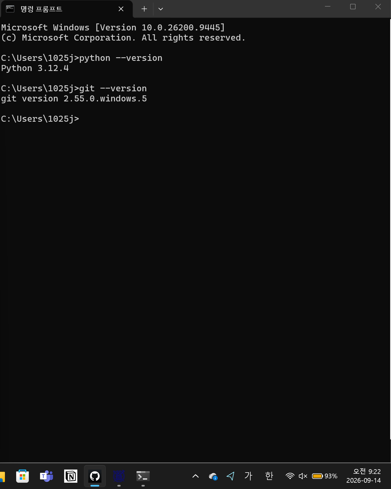
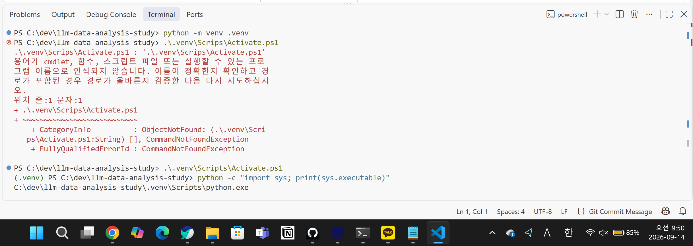
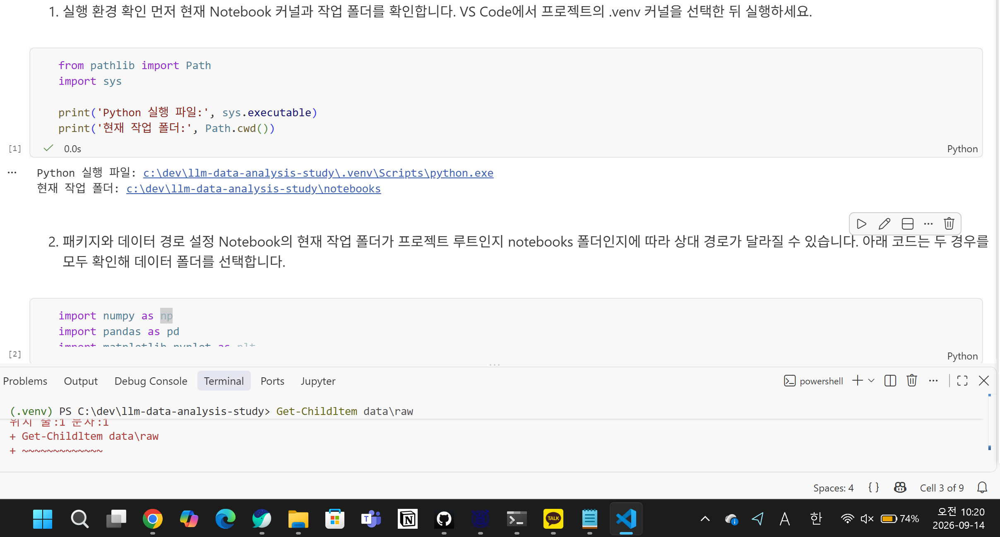
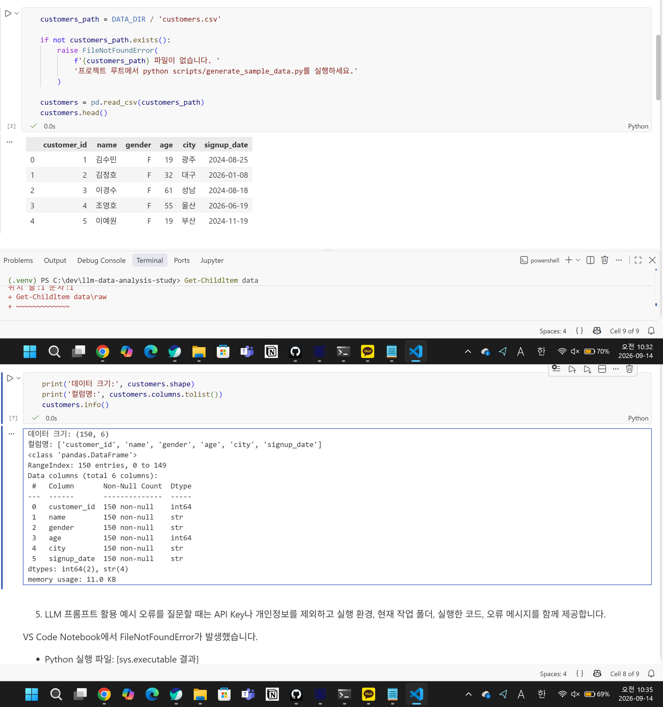
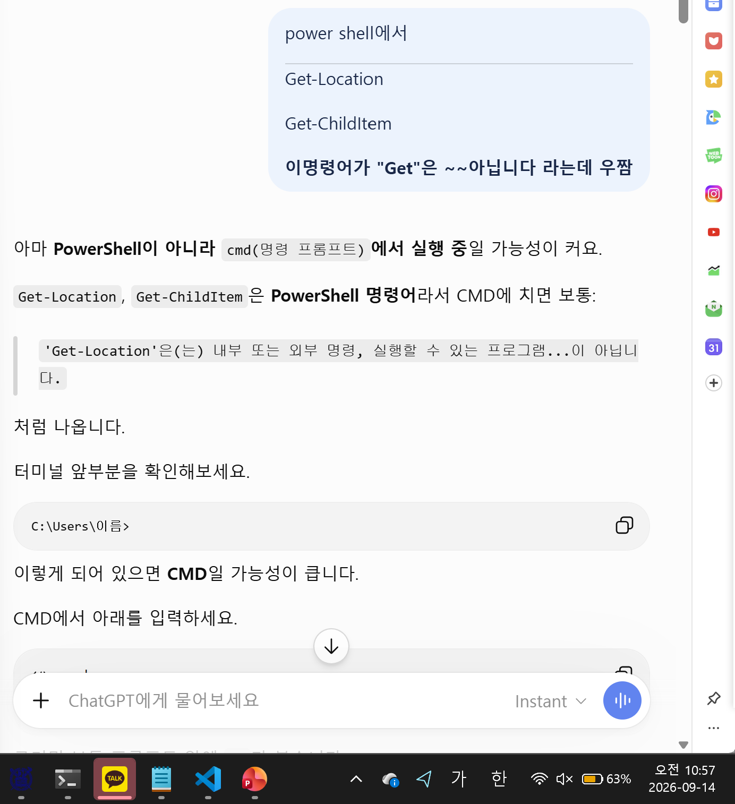
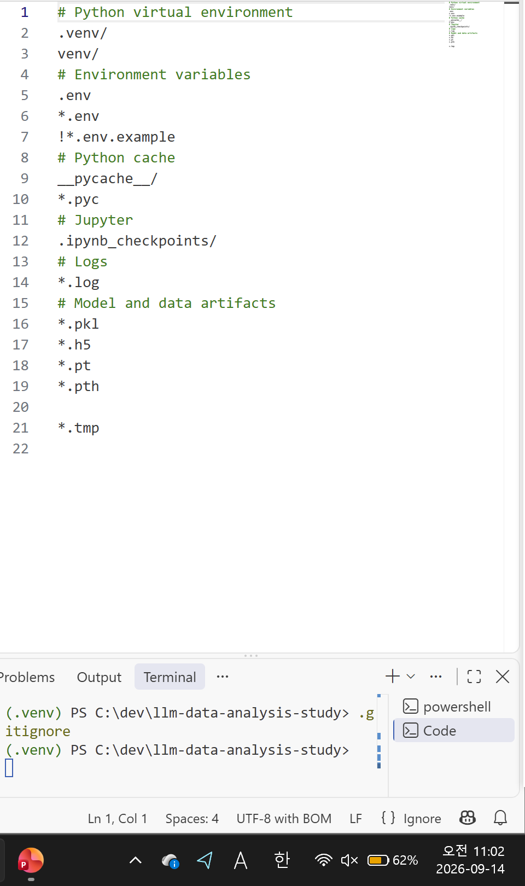

# Chapter 02 제출 답안. VS Code에서 시작하는 데이터 분석 환경

> 최종 파일은 개인 GitHub 저장소의 `chapter02/chapter02.md`로 저장하는 것을 권장합니다.

## 0. 제출 정보

- 이름: 김지인
- GitHub ID: jiin-0
- 개인 저장소: `llm-data-analysis-study`
- 작성일: 2026.09.14
- 운영체제: Windows

### 최종 제출 URL

```text
https://github.com/jiin-0/llm-data-analysis-study/blob/main/chapter02/chapter02.md
```

---

## 1. Python과 Git 환경 확인

### 실행 내용

```text
python --version 또는 py --version
git --version
```

### 실행 결과

```text
python 버전이 3.12.4, git 버전이 2.55.0.windows.5로 확인되었다.
```

### Evidence



### 결과 관찰

python 버전이 3.12.4, git 버전이 2.55.0.windows.5로 확인되었으며 정상 출력되었다. 두 명령어 모두 현재 터미널에서 실행 가능했으며 딜레이 없이 빠르게 진행되었다.

### 나의 해석과 판단

python과 git의 기본 실행 상태가 확인되었다. Python의 경우 최신 버전이 3.14이나 안정화 버전이 3.12이므로 실습을 실행하기에 적당하며, git 최신 버전이 2.55.0이므로 실습을 진행하기에 낙후된 버전이 아니다. 따라서 다음 단계로 넘어가기에 적합하다고 생각했다.

### 업무·분석적 의미

프로젝트 시작 전 버전과 도구 상태 확인이 필요하다. 이러한 프로그램들은 지속적인 업데이트로 새 버전이 나오기 때문에 버전을 확인하지 않고 프로젝트를 시작하면 구동 불가능한 부분들이 발생할 수 있다. 버전 확인을 통해 필요한 경우 최신 버전 혹은 미설치 프로그램을 다운 받아 이후 진행 과정에서 생길 문제를 사전에 방지할 수 있다.

### 한계와 추가 확인 사항

각 프로그램의 버전만 확인하였을 뿐 직접 작동이 제대로 되는지 확인해보지 않아 확인이 필요하다.

---

## 2. 저장소와 `.venv` 준비

### 수행 내용

- [O] 공식 Public 저장소 clone
- [O] 프로젝트 루트 확인
- [O] `.venv` 생성
- [O] `.venv` 활성화
- [O] `requirements.txt` 설치

### 핵심 실행 결과

```text
현재 프로젝트 경로:C:\dev\llm-data-analysis-study
터미널 Python 실행 파일: C:\dev\llm-data-analysis-study\.venv\Scripts\python.exe
가상환경 활성화 여부: O : (.venv)나타남
패키지 설치 결과: requirements.txt에서 지정한 패키지들을 pip install -r을 이용해 구현한 가상환경에 설치 실행하였고, 설치되었다.
```

### Evidence



### 결과 관찰

작동 결과, 터미널에 (.venv)가 표시되었으며 이후 작동시킨 sys.executable 결과에도 .venv 경로가 포함되어 있었다. 사용 python을 확인한 결과 공용의 python이 아닌 이 프로젝트의 가상공간 내부에 있는 python을 사용함을 알 수 있었다.

### 나의 해석과 판단

시스템 python으로 프로젝트를 진행 시 각 프로젝트마다 사용하는 패키지가 점차 누적되게 되어 작동에 있어 과부하가 걸리기 쉽다. 따라서 프로젝트마다 .venv로 가상 환경을 분리하여 시스템이 꼬이는 것을 막아줄 수 있다. 또한 산출 결과를 통해 표시만 활성화 된 것이 아니라 실제 python 명령도 프로젝트 전용 환경에서 사용하고 있음을 확인했다.

### 업무·분석적 의미

venv 명령어를 통해 프로젝트 내 가상환경을 제작하였다. 가상 환경이 아닌 실제 컴퓨터의 로컬 환경을 사용할 경우 다른 사람이 해당 프로젝트 시 파일 경로에 따라 오류가 날 수 있다. 따라서 프로젝트의 가상환경을 만들어두면 타인도 오류없이 작동시킬 수 있는 장점이 있다.

### 한계와 추가 확인 사항

현재의 python은 3.12.4이므로 최신의 python 기능이나 디버깅이 되어 있지 않는 한계가 존재한다.

---

## 3. VS Code 인터프리터와 Jupyter 커널 연결

### 확인 결과

```text
VS Code Python 인터프리터: .venv\Scrips\python.exe
Notebook sys.executable: c:\dev\llm-data-analysis-study\.venv\Scripts\python.exe
Notebook Path.cwd():c:\dev\llm-data-analysis-study\notebooks
```

### Evidence



### 결과 관찰

터미널 python과 notebook python은 모두 '.venv\Scripts\python.exe'로 동일한 것으로 확인되었다.
현재 작업폴더(notebook path)도 저장소 내부 경로를 가리키고 있었다.

### 나의 해석과 판단

현재 터미널과 notebook의 python이 동일한데 동일하지 않을 경우 별도의 python을 시스템이 사용하는 것이므로 각각이 설치되는 패키지의 차이가 발생할 수 있다. 이로 인해 ModuleNotFoundError, 패키지 import 실패가 발생할 수 있다.

### 업무·분석적 의미

터미널과 notebook이 동일한 가상환경의 python을 사용하게 되면 python 환경이 동일하게 적용되기 때문에 터미널의 가상환경에 설치된 패키지도 notebook에 동일하게 사용할 수 있다. 따라서 두 조건에 모두 동일한 환경이 생성되므로 ModulNotFoundError와 같은 환경이 동일하지 않아 발생하는 오류를 줄일 수 있다.

### 한계와 추가 확인 사항

커널 이름만 보고 단순히 같은 python인지 섣부르게 판단해서는 안된다. 커널 이름은 사용자가 임의로 지정가능한 영역이기 때문에 이름이 동일하더라도 다른 python일 수 있다. 따라서 python의 경로를 통해 두 python이 동일한 python인지 확인해야 한다.


---

## 4. 샘플 데이터와 Notebook 실행 검증

### 확인 결과

```text
DATA_DIR 존재 여부: O
customers.csv 존재 여부: O
customers.shape: (150, 6)-150 rows, 6 columns
주요 컬럼: 'customer_id', 'name', 'gender', 'age', 'city', 'signup_date'
```

### Evidence



### 결과 관찰

'customers.head()' 코드를 통해 customer.csv 파일의 상위 5개(cutomer_id 1-5)의 row을 확인할 수 있었다. csv상의 컬럼명들과 값들을 확인할 수 있었다.
shape를 통해 해당 csv파일의 구성을 확인하였다. 확인결과 (150,6)으로 나타났고, 이는 150개의 열과 6개의 컬럼으로 구성되어 있음을 나타낸다.
columns.tolist()를 통해 컬럼명을, info()를 통해 각 column 데이터의 data type에 대해 확인할 수 있었다. 

### 나의 해석과 판단

현재까지의 결과를 통해 터미널의 python과 notebook python이 동일하며 제대로 작동하고 있음을 확인할 수 있었다. 또한, requirements.txt를 통해 설치한 numpy, pandas, matplotlib.pyplot, seaborn이 정상설치 및 정상 import됨을 확인할 수 있었으며, notebook 환경에서 정상 구동 되어 CSV 파일을 요약할 수 있었다.

따라서 현재 가상환경 내 파이썬과 .venv, 설치한 패키지, VS code, notebook 커널, 작업경로, CSV 데이터가 원활히 연결되어 있음을 알 수 있다.

### 업무·분석적 의미

스모크 테스트는 핵심 기능이 기본적으로 작동하는지 빠르게 확인하는 예비 테스트로, 주요한 테스트 이전에 실행하여 초기 에러들을 확인함에 목적이 있다. 가장 기본적인 환경을 확인하여 이후 오류발생 시 오류의 추적의 범위를 제한하고, 프로젝트에 핵심에서 작동할 패키지들의 정상 작동을 확인한다. 이를 통해 기본적인 오류에서 출발해 점차 형태가 무한히 불어나는 오류들을 사전에 방지할 수 있다.

### 한계와 추가 확인 사항

현재 환경 연결을 확인한 후 원하는 파일에 대해 각 python, 패키지가 정상 작동하는지 확인하였다. 그러나 대상이 되는 파일의 data 상태를 확인해보지 않았으므로 확인이 필요하다.

---

## 5. 오류 해결 기록

실습 중 오류가 있었다면 작성합니다. 오류가 없었다면 `해당 없음`이라고 적습니다.

### 오류 메시지

```text
'Get-Location'은(는) 내부 또는 외부 명령, 실행할 수 있는 프로그램...이 아닙니다.
```

### 원인 후보

1. 모르겠음
2.
3.

### 내가 확인한 순서

1. chatGPT에 환경(powershell)과 오류 명령어(Get-Location), 오류 메세지를 입력하여 오류 해석을 요구
-관련 사전 지식이 없고 실습 블로그상 정상 작동되며, 오류 메세지를 통해 단순 명령어 수정이 가능하지 않다고 판단되어 GPT에게 곧바로 질문.

### 해결 방법

```text
powershell 코드를 명령 프롬프트에 맞게 수정
```

### Evidence



### 나의 해석과 판단

다른 해결 방법이 보이지 않아, LLM의 도움을 받았고, 이를 통해 power shell과 명령 프롬프트가 명령어상 차이가 있다는 것을 알게 되었다.

### 한계와 추가 확인 사항

유사한 작동을 하지만 다른 체계를 가지고 있는 powershell과 cmd 관련 지식이 부족하여 가장 기본적인 이해를 위한 추가 공부가 필요할 것 같다.

---

## 6. Secret 보호 확인

- [O] `.env`는 Git 추적 대상이 아닙니다.
- [O] 실제 API Key를 코드에 작성하지 않았습니다.
- [O] 캡처 화면에 Token/비밀번호가 없습니다.
- [O] `.venv`를 Git에 올리지 않습니다.

### Evidence

필요한 경우 `git status`, `.gitignore` 확인 화면을 첨부합니다.



### 나의 해석과 판단

환경 파일은 프로젝트에 필요시 타인과 공유하여 타인의 컴퓨터에서도 구동되도록 보통 설정한다. 따라서 환경파일에 비밀정보를 담게 되면 환경 공유시 비밀정보가 함께 공유된다. 따라서 민감한 정보를 .gitignore 기능을 활용하여 따로 보관 및 Git 추적 제한을 설정해야 한다. 

---

## 7. Chapter 02 최종 회고

### 가장 중요했다고 생각한 환경 설정 1가지

```text
작성하세요.
```

### 그 이유

```text
작성하세요.
```

### 다음 Chapter에서 재사용할 환경 체크 3가지

1. (.venv) 환경인지 확인
2. terminal python과 notebook python 동일한지 확인
3. VS code, notebook, terminal, data file 등이 연결이 잘 되었는지 확인

### 현재 환경의 한계 또는 주의점

```text
프로젝트를 위해 .venv 환경을 구현하였으므로 해당 환경에서 작동하는지 확인 해야한다.
```

---

## 최종 제출 체크

- [O] 핵심 Evidence 4~7장을 첨부했습니다.
- [O] 단순 캡처가 아니라 관찰과 판단을 작성했습니다.
- [O] Secret/개인정보가 없습니다.
- [O] GitHub에서 이미지가 정상 표시됩니다.
- [O] 개인 저장소에 `chapter02/chapter02.md`를 업로드했습니다.
- [O] 저장소 URL이 아니라 최종 파일 URL을 제출합니다.
