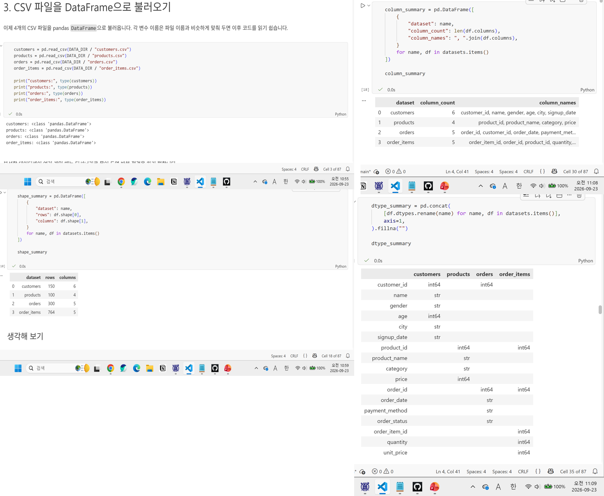
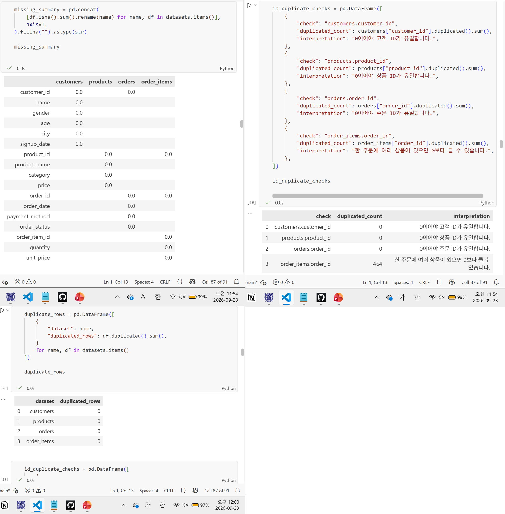
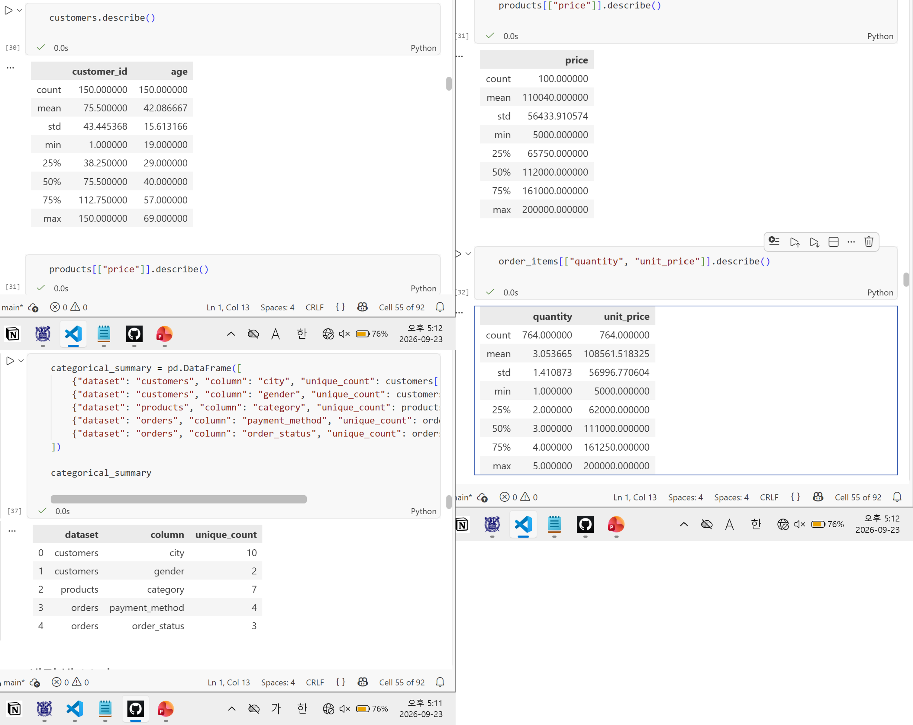
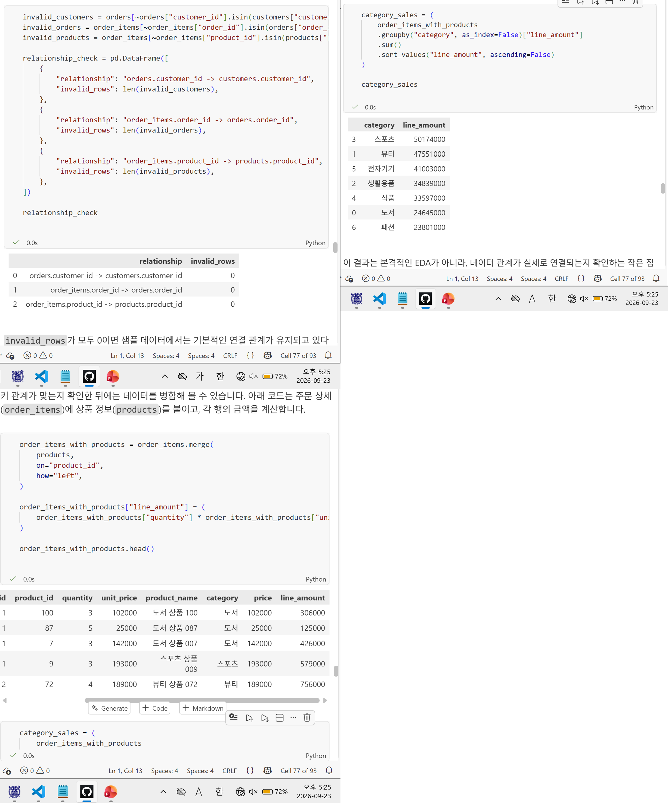
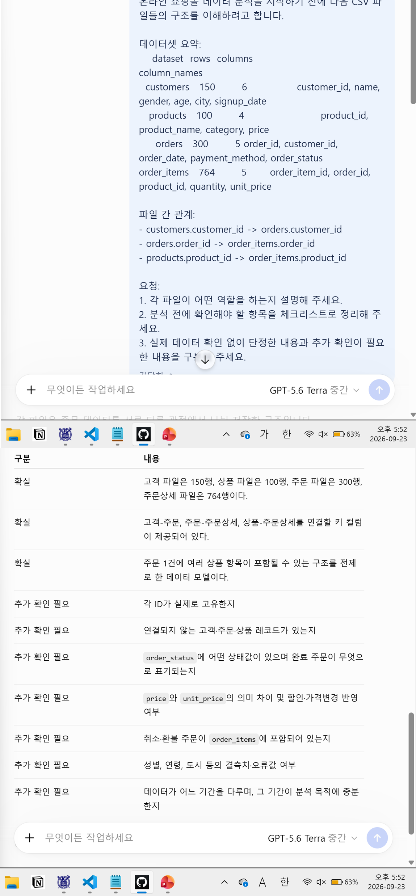

# Chapter 03 제출 답안 양식. 데이터의 첫인상 읽기

> 주 제출물은 실행 완료 Notebook `chapter03/chapter03.ipynb`입니다. 이 양식의 항목을 Notebook의 Markdown 셀로 추가해 작성합니다.

## 0. 제출 정보
- 이름: 김지인
- GitHub ID: jiin-0
- 작성일: 2026.09.23
- 최종 제출 URL: https://github.com/jiin-0/llm-data-analysis-study/blob/b0da74a653a32ca4fbd907e9a3e2600874819d4a/chapter03/ch03_data_overview.ipynb

## 1. 데이터 로딩과 구조 확인
### 실행/결과
- 4개 CSV 로딩 여부: 로딩 성공(CSV to Dataframe)
- 각 데이터 shape: |customers(150,6)|products(100,4)|orders(300,5)|order_items(764,5)|
- 주요 컬럼:|customers.customer_id|products.product_id|orders.order_id|orders.customer_id|order_itmes.order_order_item_id|order_items.order_id|order_items.product_id
- dtypes에서 주목한 컬럼: signup_date, order_date - 모두 날짜형데이터이나 str(문자형데이터)로 나타났다.

### Evidence

### 결과 관찰
4개의 CSV 파일이 모두 데이터프레임형식으로 로딩 되었다. 각 파일이 몇개의 행과 열로 구성되어있는지 shape을 통해 확인하였고, 행이 가장 많은 파일은 order_items로 나타났다. head(), tail()을 통해 상위 5열, 하위 5열의 데이터를 확인하여 각 컬럼에 데이터가 어떤 형식으로 들어있는지 직관적으로 확인하였다. info(), columns를 이용하여 각 파일의 컬럼 정보를 확인하였으며, 파일간 공통적인 컬럼(customer_id, product_id, order_id)이 관찰되었다. 또한, 직관적으로 날짜형인 데이터(signup_date, order_date)가 실제 dtypes로 확인할 결과 문자형으로 확인되었다.

### 나의 해석과 판단
order_items의 행이 orders보다 많으므로 주문 1건에 여러개의 아이템을 구매한 경우가 포함되어 있다고 해석할 수 있다. 또한, customers의 customer_id를 통해 고객을, orders의 order_id를 통해 주문을, products의 products_id를 통해 상품을 구분할 수 있을 것이다. 또한 파일간 공통적인 컬럼들을 통해 파일을 연결할 수 있을 것이다.
현재 dtypes로 확인한 결과 signup_date와 order_date의 형식이 문자열이므로 날짜로 인식되고 있지 않다. 따라서 이를 목적에 따라 날짜형으로 변환하는 과정이 필요하다. 또한, orders.order_id, customers.customer_id가 파일 내에서 중복되지 않는지 확인이 필요하다. 

### 업무·분석적 의미
구조를 먼저 확인하지 않을 경우 각 파일에 어떤 컬럼들, 어떤 정보들이 있는지 파악이 되지 않는다. 또한 각 파일 사이 연결되는 컬럼이 있는지 확인하지 않으면 파일간 연결 시 시작을 할 수 없다.
각 컬럼의 형식을 확인하여 기대되는 형식과 실제 형식이 일치하는지 확인하여 데이터가 원하는 형식으로 읽혔는지, 데이터에 오류가 있는지 간단히 확인할 수 있다. 이를 통해 추후 이어질 분석에서 발생할 형식에 따른 오류 발생을 줄일 수 있다.
또한 파일간 공통적인 컬럼이 customer_id, product_id, order_id의 형식이 현재 모든 파일에서 일치하므로 이를 기준으로 파일을 연결할 때 오류가 여지를 줄일 수 있다.

### 한계와 추가 확인 사항
각 파일에 컬럼이 무엇이 있고, 데이터 형식이 무엇인지, 상하위 5개의 데이터를 확인하였다. 그러나 실제 모든 데이터에 오류가 있는지 확인하지 못했다. 따라서 가장 큰 틀에서 데이터를 파악했기 때문에 세부적인 데이터를 확인하는 과정이 필요하다.

## 2. 결측·중복·키 품질
- 주요 ID 결측: X
- 주요 ID 중복: X
- 전체 행 중복: X

### 결과 관찰
결측 관찰 결과, 모든 column에서 결측이 관찰되지 않았다. 주요 ID 중복 관찰결과, customers.customer_id, products.product_id, orders.order_id에서 중복이 관찰되지 않았다. order_items.order_id에서는 중복이 관찰되었다. duplicated()로 관찰한 결과 전체 행 중복 또한 관찰되지 않았다.

### 나의 해석과 판단
어떤 문제를 먼저 처리해야 하는지 우선순위를 작성하세요.
데이터 관찰 결과 주요 컬럼에서 결측과 중복이 나타나지 않았다. order_itmes.order_id에서는 중복이 관찰되었으나 order_items.order_id은 중복가능(한 주문에 여러 상품이 있을 수 있음.)

### 업무·분석적 의미
결측의 존재 확인하여 데이터의 품질을 확인할 수 있다. 데이터 상황에 맞게 결측치를 처리하여 데이터의 품질을 높여 데이터 분석의 정확성을 높일 수 있다. 중복을 점검하고 중복이 오류인지, 유의미한 중복인지 확인하여 데이터에 대한 이해를 높일 수 있고, 분석의 정확성 또한 높일 수 있다.

### 한계와 추가 확인 사항
중복과 결측을 확인하였으나 각 입력되어 있는 데이터 값 자체에 오류가 없는지 확인이 필요하다. 따라서 원치 않는 형식으로 읽힌 날짜열, id열을 형식을 바꿔주며 확인할 필요가 있다.

## 3. 숫자형·범주형·날짜 점검
- 숫자형 범위에서 주목한 값: age, price, quantity, unit_price
- 범주형 빈도에서 주목한 값: city, category, order_status
- 날짜 변환 실패 건수: 0
- 날짜 범위: (2025-09-14, 2026-09-13)

### 결과 관찰
숫자열인 customers.customer_id, customers.age, products.price, order_items.quantity, order_items.unit_price를 describe()로 통계량을 확인하였다. age의 범위는 19-69, price의 범위는 5000-200000, quantity의 범위는 1-5, unit_price의 범위는 5000-200000로 나타났다.
범주형에서는 city, category, order_status의 빈도를 value_counts()로 확인하였다. city에는 성남, 광주를 비롯해 총 10개의 범주가, category에는 스포츠, 전자기기를 포함해 7개의 범주가, order_status에는 completed, cancelled, refunded로 총 3개의 범주가 확인되었다.
문자열로 나타난 날짜를 날짜로 변환하였다. 변환결과 실패없이 모두 변환되었고, 2025-09-14부터 2026-09-13까지로 나타났다.

### 나의 해석과 판단
이상해 보이는 값이 실제 오류인지 업무적으로 가능한 값인지 구분하기 위해 무엇을 더 확인해야 하는지 작성하세요.
숫자형 범위에서 age, price, quantity, unit_price 모두 정상 범위로 관찰되었다. 또한, age의 경우 각 나이대별로 고르게 분포하고 있음을 추정할 수 있었다. 범주형 데이터에서는 영어에 해당하는 order_status의 각 항목이 대소문자 차이로 나뉘어 카운트 되는 일이 발생하지 않았다. 만약 대소문자가 달라 다른 범주로 나누어지면 소문자나 대문자로 각 문자열을 통일시킨 뒤 다시 카운트 해야한다. 범주형 데이터에서 각 특정 항목에 몰려있지 않고 전체적으로 고르게 분포되어 있었다.

### 업무·분석적 의미
숫자형과 범주형 데이터 분석을 통해 각 데이터의 분포를 확인할 수 있다. 특히 데이터 분석에 있어 통계적 검증에 필요한 표본의 분포에 대해 파악할 수 있다.

### 한계와 추가 확인 사항
ID가 숫자열로 인식되어 숫자열 분포 파악에 포함되었다. 숫자열 중에서도 필요한 숫자열만 선택적으로 서열을 보는 것이 좋다. 필요 시 이런 ID column의 데이터 형태를 변환이 필요하다.

## 4. CSV 간 키 관계 검증
- 없는 `customer_id`: 0
- 없는 `order_id`: 0
- 없는 `product_id`: 0

### 결과 관찰
orders.customer_id에 있는 모든 값은 customers.customer_id에 존재하였고, order_items.order_id의 값들은 orders.order_id에 존재하였다. 또한 order_items.product_id에 존재하는 값들은 products.product_id에 존재하였다. 이러한 공통 키를 이용해 merge()로 병합한 결과 각 공통 키에 해당하는 데이터 값들이 정렬 되어 customer_id-order_id-product_id-quantity-unit_price-product_name-category-price-line_amount에 해당하는 값들이 하나의 dataframe으로 정리되었다.
groupby를 통해 각 범주에 해당하는 금액이 dataframe으로 반환되었다.

### 나의 해석과 판단
각 키가 모두 적절히 존재하였으므로, 파일의 연결상에 문제가 없을 것으로 기대된다. 또한 키 관계에 문제가 발견되었을 경우 누락이 어느쪽에서 되었는지 정확히 파악해야하므로 바로 삭제해서는 안되며, 각 키의 형태가 일치하는지 확인하여 문제를 수정해야하므로 곧장 삭제해서는 안된다.

### 업무·분석적 의미
이처럼 키 관계 확인을 통해 데이터 관계가 실제로 연결되는지 정확하지 않지만 간단히 확인할 수 있고, 문제 발생 시 수정하여 후에 생길 오류들을 줄일 수 있다.

### 한계와 추가 확인 사항
전체 데이터가 정확히 키값이 일치하여 연결되는지 확인한 것이 아니므로 완전히 연결되었다는 판단을 내려서는 안된다.

## 5. LLM 구조 설명 검증
- LLM에 제공한 Safe Context: 온라인 쇼핑몰 데이터 분석을 시작하기 전에 다음 CSV 파일들의 구조를 이해하려고 합니다. 데이터셋 요약: dataset rows columns column_names customers 150 6 customer_id, name, gender, age, city, signup_date products 100 4 product_id, product_name, category, price orders 300 5 order_id, customer_id, order_date, payment_method, order_status order_items 764 5 order_item_id, order_id, product_id, quantity, unit_price 파일 간 관계: - customers.customer_id -> orders.customer_id - orders.order_id -> order_items.order_id - products.product_id -> order_items.product_id 요청: 1. 각 파일이 어떤 역할을 하는지 설명해 주세요. 2. 분석 전에 확인해야 할 항목을 체크리스트로 정리해 주세요. 3. 실제 데이터 확인 없이 단정한 내용과 추가 확인이 필요한 내용을 구분해 주세요.

- LLM이 제안한 추가 점검:
- 1. 상품 기준 가격(products.price)과 실제 주문 당시 단가(order_items.unit_price)의 차이 확인
  2. 연결되지 않는 고객·주문·상품 레코드가 있는지
  3. 데이터가 어느 기간을 다루며, 그 기간이 분석 목적에 충분한지
  4. 연결 키에 결측치가 없는지 확인
  5. 같은 주문에 동일 상품이 여러 줄로 중복 기록되었는지 확인
- 실제 데이터에서 확인한 항목: 
3-데이터가 다루는 기간은 2025-09-14부터 2026-09-13이다. 그러나 현재 분석 목적이 정해져 있지 않아 충분한지 파악할 수 없다.
4-isna().sum()으로 결측은 존재하지 않는 것으로 앞서 확인하였다.
5-duplicated를 통해 확인하였다.
- 채택/수정/보류한 내용: 
1(채택)-실제 데이터 전처리에 있어 결측이 없는 것은 확인하였으나 다른 경우가 있는지 확인이 필요하기 때문에 채택하였다.
2(채택)-고객(customer_id), 주문(order_id), 상품 레코드(product_id)사이 연결을 통해 데이터 품질을 확인할 수 있으므로 필요하여 채택하였다.
3(보류)-분석 목적이 불분명하여 보류하였다.
4(채택)-결측 존재 여부 파악이 필요하며, 확인결과 결측이 존재하지 않았다.
5(채택)-중복 존재할 경우 중복처리 방법에 대한 논의가 필요하며, 전처리 과정에서 필수적이므로 채택하였고, 중복 행이 없는 것으로 확인하였다.

### 나의 해석과 판단
LLM 제안 중 가장 유용했던 것은 '상품 기준 가격(products.price)과 실제 주문 당시 단가(order_items.unit_price)의 차이 확인'이었다. products에 기입된 price와 order_items에 기입된 가격에 차이가 존재할 경우 수정이 필요하며, 다른 제안의 경우 앞서 다룬 내용이 주를 이루었기 때문이다.
이처럼 LLM에게 제안을 요구할 경우 민감 정보를 포함해서는 안되며 데이터 전체가 아닌 요약정보를 전달해야한다. 또한, 요약을 제공하기 때문에 LLM의 제안이 실제 데이터 상에서 불가능할 수 있다는 점을 인지하여 검토하는 태도가 필요하다.

### 한계와 추가 확인 사항
LLM은 분석에 있어 메인이 아니라는 점을 인지하고 있어야 하며, 보조 도구로 활용해야 한다. 또한, LLM의 제안이 분석 목적에 부합하는지 필요에 따라 확인 해야한다.

## 6. Chapter 03 최종 판단
### 데이터의 첫인상 3가지
1. CSV 파일을 Dataframe으로 로딩하고 기본적인 정보(info)를 파악해야한다.
2. 데이터내 결측과 중복 여부를 확인하고 목적에 맞게 결측과 중복을 처리해야한다.
3. LLM에게 데어터를 제공할 때 전체를 제공하는 것이 아닌 요약하여 구조로 제공해야한다.

### 다음 Chapter 전에 반드시 확인/처리해야 할 항목
1. 다음 Chapter 전 실습에서 다루었던 컬럼 정보, 데이터 형식 파악이 필수적이다.
2. 날짜 데이터를 문자열에서 날짜열로 변환해야한다.
3. 다음 Chapter 전 파이썬 및 커널이 올바르게 연결되었는지 확인해야한다.

### 현재 데이터만으로 단정할 수 없는 것
파일내 키로 모든 데이터가 연결되었는지 단정할 수 없다.

## 최종 제출 체크
- [O] Notebook을 처음부터 끝까지 실행했습니다.
- [O] 오류 셀이 남아 있지 않습니다.
- [O] 핵심 Evidence를 첨부했습니다.
- [O] 관찰과 해석을 구분했습니다.
- [O] 개인정보/Secret이 없습니다.
- [O] `chapter03/chapter03.ipynb`가 GitHub에서 정상 표시됩니다.
- [O] 최종 Notebook 파일 URL을 제출합니다.
